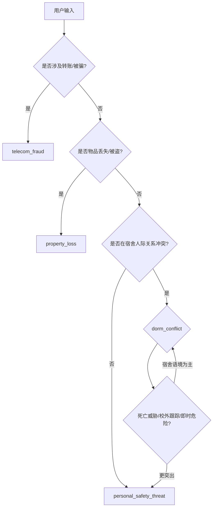

# 四类场景消歧指南

供分类模型、规则模块与测试案例维护使用。维护：陆宣辰。

## 1. 决策流程（简图）

## 2. 关键词倾向（非绝对）

| 关键词/表述 | 倾向场景 |
|---------------|----------|
| 转账、刷单、客服、投资、拉黑、诈骗 | telecom_fraud |
| 丢了、不见了、被偷、监控、挂失 | property_loss |
| 室友、舍友、宿舍、换宿、辅导员调解 | dorm_conflict |
| 威胁、跟踪、堵人、害怕、杀人、楼下 | personal_safety_threat |

## 3. 高频混淆对

### 3.1 telecom_fraud vs property_loss

| 情形 | 正确场景 | 说明 |
|------|----------|------|
| 二手群转账后没收到货 | telecom_fraud | 已支付、对方失联 |
| 手机在食堂被偷 | property_loss | 物理丢失 |
| 快递货架被拆 | property_loss | loss-011 |
| 退款保证金二次诈骗 | telecom_fraud | fraud-011 |

**测试案例**：fraud-007、loss-011、dlg-misclass-001

### 3.2 dorm_conflict vs personal_safety_threat

| 情形 | 正确场景 | 可接受备选 |
|------|----------|------------|
| 室友说“要打你” | dorm_conflict | personal_safety_threat |
| 室友说“杀死你” | 两者皆可 | threat-007 |
| 前男友楼下堵人 | personal_safety_threat | — |
| 宿舍群辱骂无威胁 | dorm_conflict | conflict-011 |
| 校外网约车跟踪 | personal_safety_threat | threat-010 |

**测试案例**：conflict-005、threat-007、dlg-misclass-002

### 3.3 property_loss vs dorm_conflict

| 情形 | 正确场景 |
|------|----------|
| 室友翻抽屉用充电宝 | dorm_conflict |
| 手机丢在宿舍且怕盗刷 | property_loss |
| 充电器被室友拿走未还 | dorm_conflict（侵权） |

**测试案例**：conflict-007、loss-008

### 3.4 极短输入

| 输入 | 首轮 acceptable | 第二轮澄清 |
|------|-----------------|------------|
| 东西没了钱也没了 | 多类 | dlg-misclass-001 → fraud |
| 有人要打我 | threat / dorm | dlg-misclass-002 → dorm |
| 东西丢了 | loss | dlg-loss-002 |

## 4. 风险升级规则（与场景无关）

出现以下表述时，**至少 medium，通常 high**：

- 仍在转账 / 催款
- 身份证、银行卡、支付账号未保护
- 肢体冲突、受伤
- 威胁正在发生、堵人、无法离开
- 武器图片、死亡威胁

## 5. 案例索引（boundary 标签）

| ID | 主场景 | 备选 |
|----|--------|------|
| fraud-007 | telecom_fraud | property_loss |
| fraud-011 | telecom_fraud | — |
| loss-008 | property_loss | dorm_conflict |
| loss-011 | property_loss | telecom_fraud |
| conflict-005 | dorm_conflict | personal_safety_threat |
| conflict-007 | dorm_conflict | property_loss |
| conflict-011 | dorm_conflict | personal_safety_threat |
| threat-007 | personal_safety_threat | dorm_conflict |
| threat-011 | personal_safety_threat | dorm_conflict |
| threat-012 | personal_safety_threat | dorm_conflict |
